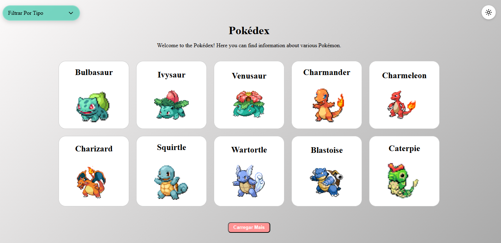
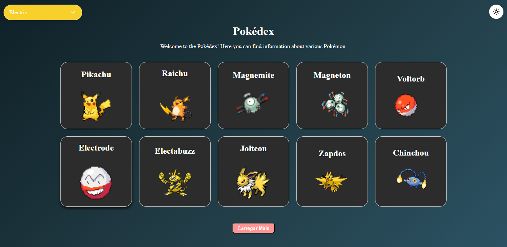
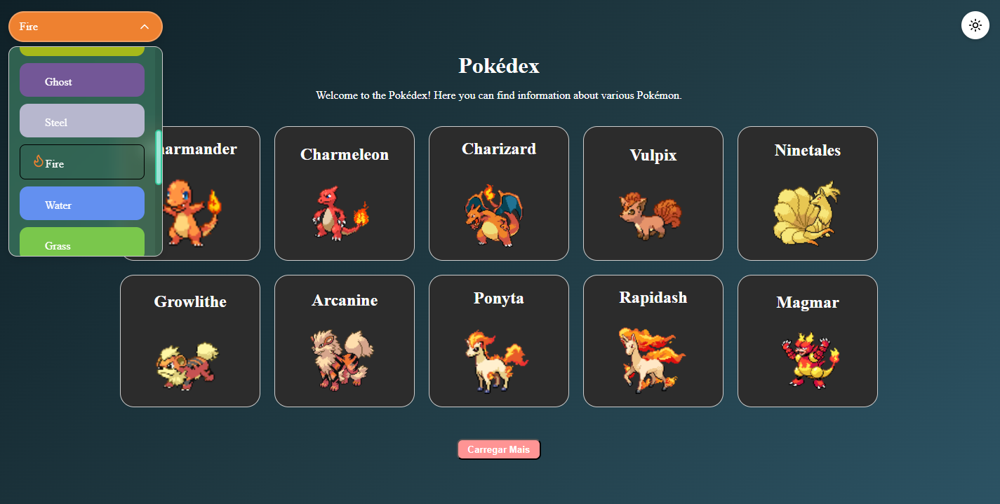
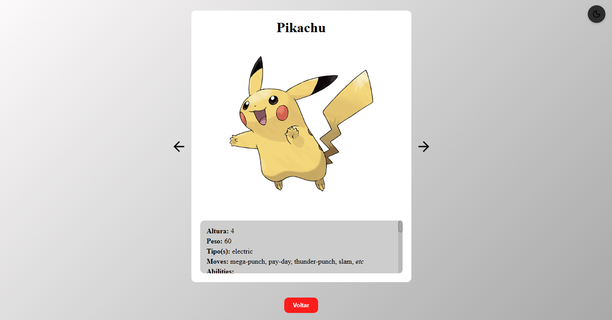
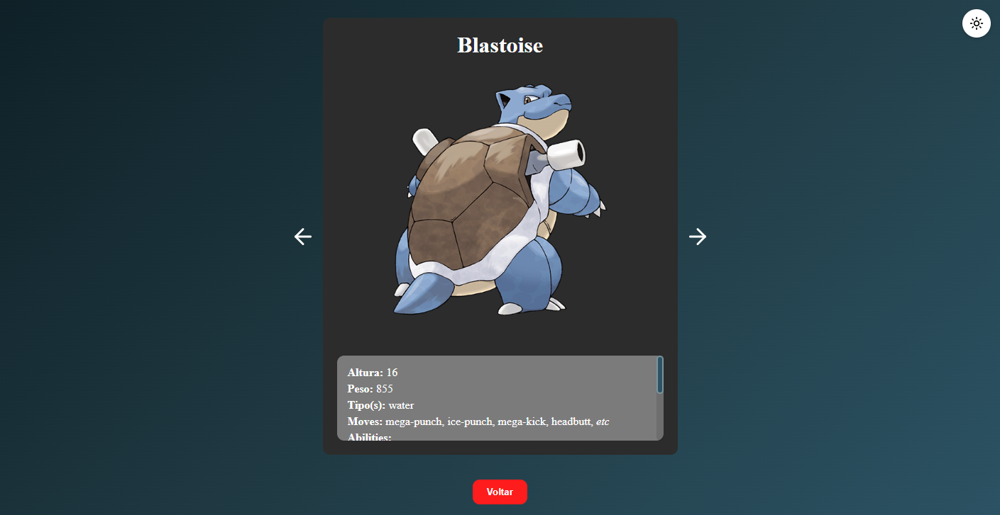
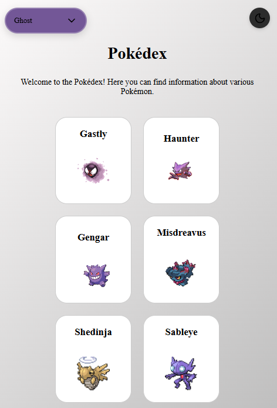
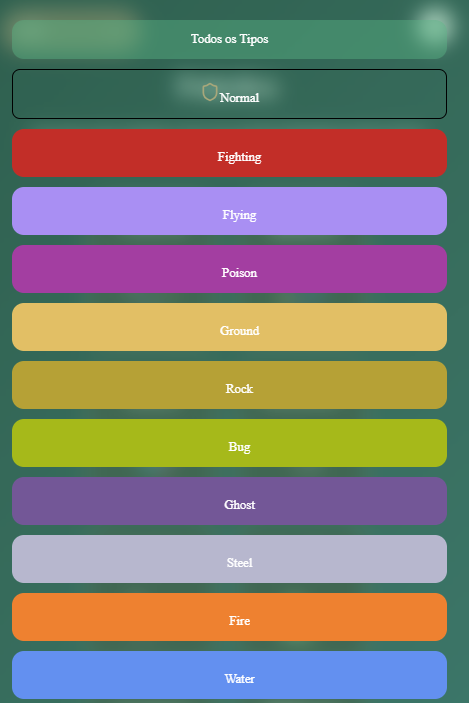
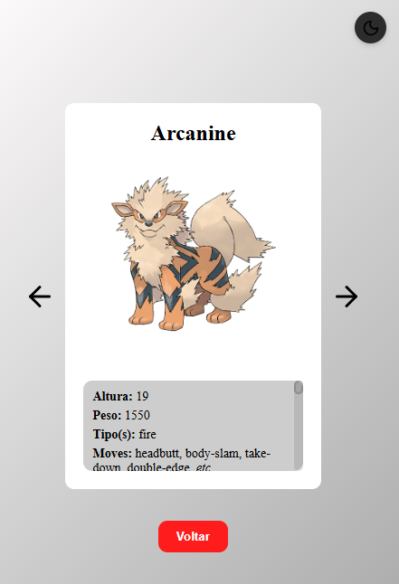
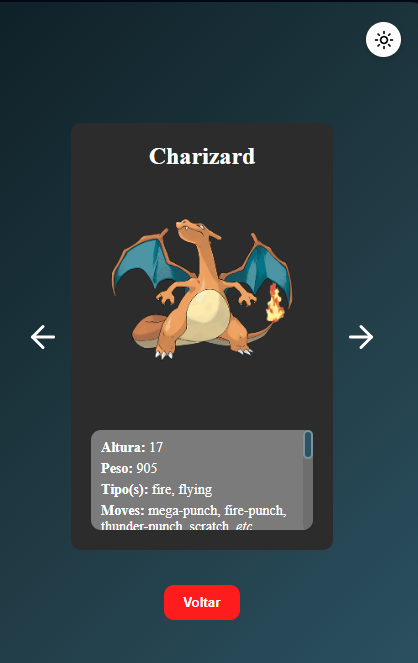

# Pokédex React 

## 1 - Descrição

Este é um projeto realizado para cumprir a exigência proposta pelo módulo de "Quest - React Avançado", do curso "Dev Quest FrontEnd". Trata-se de uma aplicação SPA (Single Page Application), na qual temos nossa "Home" (página principal) e outra rota para o card ampliado do pokémon (CardExtendedPage.jsx). 

<div align="center">
    
</div>

## 2 - Funcionalidades 

### Design Desktop

Na nossa "Home" temos nosso cabeçalho, com o título e breve parágrafo de saudação da pokédex. No canto superior esquerdo está nosso menu para filtrar os pokémons pelo tipo deles; já no canto superior direito temos o nosso botão alternador de temas!

Inicialmente temos apenas 10 "cards" com 10 pokémons, porém, ao clicar no botão "Carregar Mais", será feita uma iteração no nosso serviço de chamada à API, a qual retornará mais 10 pokémons, somando-os na lista inicial. Ao recarregar a página, a configuração inicial fica padrão com apenas 10. 

<div align="center">
    
    
    
</div>

### Card Pokémon Ampliado Desktop

No card ampliado do pokémon, temps suas informações detalhadas (nome, imagem, altura, peso, tipo e movimentos aprendidos). Além desses, temos também a lista de habilidades possíveis que esse pokémon pode ter, bem como suas respectivas descrições.

É possível navegar entre os pokémons pelas setas à direita e à esquerda do respectivo pokémon, bem como voltar para a "Home" através do botão "Voltar".

<div align="center">
    
     
</div>

### Design Mobile

<div align="center">
    
    
</div>

No design mobile, para uma melhor experiência do usuário, deixamos o menu seletor de tipos como um "menu dropdown" ocupando toda a tela, facilitando a interação entre usuário e interface. 

<div align="center">
    
</div>

### Card Pokémon Ampliado Mobile

<div align="center">
    
    
</div>

## 3 - Ferramentas Utilizadas

### Conceitos de JavaScript & Boas Práticas

* Caminhos relativos e caminhos absolutos para arquivos do projeto; ✅
* Divisão de responsabilidades em várias pastas e arquivos; ✅
* HTML Semântico; ✅
* Display Flex & Grid; ✅
* Responsividade (mobile, tablet & desktop); ✅
* Conceitos de código assíncrono no JS (funções assíncronas; chamadas de API; async & await); ✅
* Uso da API gratuita "PokéAPI" ✅

### React - Frameworks & Bibliotecas

* Criação, uso e gerenciamento de componentes de função; ✅
* Interface SPA (Single Page Application); ✅
* Styled Components para estilização dos componentes; ✅
* React Router Dom para navegação entre as páginas; ✅
* Context API para criação e gerenciamento do botão alternador, tema claro e escuro; ✅
* Axios para facilitar e agilizar as requisições assíncronas à PokéAPI; ✅
* Jest para implementação de testes unitários; ✅
* Biblioteca Lucide-React para uso de alguns ícones já prontos (sol e lua para os temas da aplicação; setas de avançar e retroceder para navegação entre cards ampliados); ✅ 
* React-Icons (quando necessário); ✅ 

## 4 - Decisões Adotadas 

Algumas escolhas técnicas e de UX tomadas durante o desenvolvimento da aplicação:

### 4.1 - Paginação Controlada & setTimeOut()

 Escolhi alimentar a "div" principal do projeto com o botão "Carregar Mais", incrementando os pokémons abaixo dos já existentes, e não ao lado. O fato de dar o controle de quantos pokémons carregar para o usuário, evita um carregamento infinito esperado e o bloqueio do IP pela API, dada uma possível grande busca de dados. Foi exatamente por isso que optei pelo uso do setTimeOut nas minhas funções assíncronas, visto que as muitas requisições estavam bloqueando o acesso da API e podendo ocasionar uma experiência desastrosa ao usuário.

 ### 4.2 - Testes nas Funções Assíncronas & Futuros Testes nos Componentes (JSX)

Implementei testes para as funções assíncronas de serviço (relacionadas com a API), permitindo que o usuário possa rodar o "npm run test" para verificar qual o possível erro com a chamada e filtro dos dados necessários para que o projeto funcione. Futuramente pretendo implementar testes também nos componentes JSX, sendo possível testar se estão renderizando os elementos que foram criados para renderizar e, se não, onde está o problema para que não renderizem os elementos corretos.

## 5 - Como Utilizar

### Pré-requisitos

* Git instalado (https://git-scm.com)

* Node.js (recomendado >= 16) e npm (vem com o Node) — ou Yarn se preferir

* Navegador moderno (Chrome, Edge, Firefox)

* Dica: verifique as versões do seu Node com os comandos "node -v" e "npm -v" (ou yarn -v) no seu terminal (PowerShell, etc).

### Passo a Passo

1 - Clone o projeto

```

git clone <url-do-projeto>

```

2 - Acesse a pasta do projeto

```

cd pokedex_react

```

3 - Instalar Dependências

💡 Este projeto foi criado utilizando Vite como bundler (o Create React App - CRA está se tornando obsoleto), mas você não precisa instalá-lo manualmente — ele será configurado automaticamente ao executar:

```

npm install

```

4 - Rodar em Modo Desenvolvimento 

```

npm run dev

```

5 - Acesse a aplicação localmente na URL exibida no terminal (ex.: http://localhost:5173 ou http://localhost:3000). Basta segurar a tecla "ctrl" e clicar no link exibido no terminal.

### Scripts Úteis

* Confira package.json para a lista completa. Exemplos comuns:

° dev / start — inicia o servidor de desenvolvimento

° build — cria a versão de produção

° preview — pré-visualiza a build (quando disponível)

° lint — executa linter

° test — executa os testes unitários através do Jest

° watch:test - executa os testes automaticamente

### Troubleshooting (Problemas Comuns)

Erro ao resolver react-icons/fi:

Instale a dependência: ``` npm install react-icons ``` 

Porta em uso:

Altere a porta (PORT=3001 npm run dev) ou finalize o processo que está usando a porta.

Dependências quebradas:

Remova node_modules e o lockfile e reinstale:

```
rm -rf node_modules package-lock.json yarn.lock
npm install
```

Problemas com imagens locais no README:

Verifique o caminho relativo e confirme se o arquivo existe no repositório.